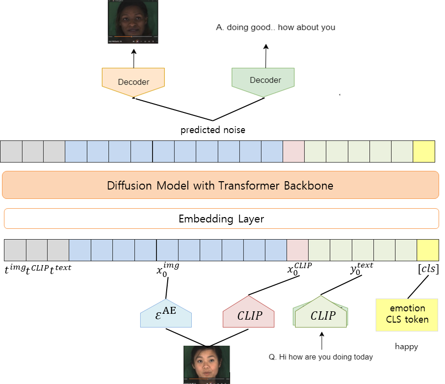

## EmpathDiffuser

This paper proposes EmpathDiffuser, a multi-modal response generation model that simultaneously produces empathetic text and facial image responses conditioned on a speaker's utterance and facial expression. While UniDiffuser enables joint distribution learning over image and text modalities for flexible generation directions, it does not handle conditional response generation in emotionally grounded contexts. We extend this capability by modifying the UniDiffuser architecture to conditionally generate multi-modal responses (x_0', y_0') given a speaker’s multi-modal input (x_0, y_0), and incorporate an auxiliary emotion classification module to ensure affective consistency. We fine-tune the model using the AvaMERG dataset, which provides aligned face images, utterances, and empathy labels. Evaluation with FID, BLEU, and emotion classification accuracy demonstrates the potential of EmpathDiffuser to capture affective context and generate coherent multi-modal responses. Both quantitative and qualitative results show the effectiveness of our approach for multi-modal empathy modeling beyond traditional text-based frameworks.



--------------------

## Dependency

```sh
conda create -n unidiffuser python=3.9
conda activate unidiffuser
pip install torch torchvision --extra-index-url https://download.pytorch.org/whl/cu116  # install torch-1.13.1
pip install accelerate==0.12.0 absl-py ml_collections einops ftfy==6.1.1 transformers==4.23.1
pip install -e git+https://github.com/openai/CLIP.git@main#egg=clip

# xformers is optional, but it would greatly speed up the attention computation.
pip install -U xformers
pip install -U --pre triton
```

* We highly suggest install [xformers](https://github.com/facebookresearch/xformers), which would greatly speed up the attention computation for *both training and inference*.


# Training
## Dependency
```sh
conda env create -f env_uvit.yml
pip install accelerate==0.12.0 absl-py ml_collections einops wandb ftfy==6.1.1 transformers==4.23.1

# xformers is optional, but it would greatly speed up the attention computation.
pip install -U xformers
pip install -U --pre triton
````
This repo is based on timm==0.3.2, for which a fix is needed to work with PyTorch 1.8.1+. (Perhaps other versions also work, but I haven't tested it.)
We highly suggest install xformers, which would greatly speed up the attention computation for both training and inference.


## Pretrained Models

UniDiffuser employs a variation of transformer, called [U-ViT](https://github.com/baofff/U-ViT), which parameterizes the joint noise prediction network. Other components perform as encoders and decoders of different modalities, including a pretrained image autoencoder from [Stable Diffusion](https://github.com/CompVis/stable-diffusion), a pretrained [image ViT-B/32 CLIP encoder](https://github.com/openai/CLIP), a pretrained [text ViT-L CLIP encoder](https://huggingface.co/openai/clip-vit-large-patch14), and a [GPT-2](https://github.com/openai/gpt-2) text decoder finetuned by ourselves.


We provide two versions of UniDiffuser, which contain U-ViT of 1B parameters and can run on a GPU with at least 10 GB memory. They can be downloaded from Hugging Face:
- [UniDiffuser-v0](https://huggingface.co/thu-ml/unidiffuser-v0): This version is trained on [LAION-5B](https://laion.ai/) at 512x512 resolution, which contains noisy webdata of text-image pairs.
- [UniDiffuser-v1](https://huggingface.co/thu-ml/unidiffuser-v1): This version is resumed from UniDiffuser-v0, and is further trained with a set of less noisy internal text-image pairs. It uses a flag as its input to distinguish webdata and internal data during training.

Both links contain three files:
- `autoencoder_kl.pth` is the weight of the image autoencoder converted from [Stable Diffusion](https://github.com/CompVis/stable-diffusion).
- `caption_decoder.pth` is the weight of the finetuned GPT-2 text decoder.
- `uvit_v0.pth or uvit_v1.pth` is the weight of U-ViT for UniDiffuser-v0 or UniDiffuser-v1.

Note that UniDiffuser-v0 and UniDiffuser-v1 share the same `autoencoder_kl.pth` and `caption_decoder.pth`. You only need to download them once.
As for other components, they will be automatically downloaded.


After downloading, create a new folder named `models` and put all pretrained models into this folder as follows:

```
├── models
│   └── autoencoder_kl.pth
│   └── caption_decoder.pth
│   └── uvit_v0.pth or uvit_v1.pth
```

## Fine-tuned Variant: EmpathDiffuser

EmpathDiffuser is a fine-tuned variant of [UniDiffuser-v1](https://huggingface.co/thu-ml/unidiffuser-v1), specifically adapted for multimodal empathetic response generation. It is trained on the [AvaMERG](https://github.com/xxx/avaMERG) dataset, which consists of paired facial images and emotional utterances.

EmpathDiffuser leverages the same backbone architecture as UniDiffuser, including the U-ViT joint noise prediction network and pretrained modality encoders. On top of this, we add an auxiliary emotion classification module and fine-tune the entire model (except for frozen encoders) to generate affectively aligned text and image responses.

You can use the original UniDiffuser-v1 weights as initialization and fine-tune with your own multimodal empathy dataset.

## Dataset Preparation

To prepare the dataset, first download the AvaMERG (Frame) dataset from Hugging Face:

https://huggingface.co/datasets/SIChoi/AvaMERG_frame

Then extract multimodal features by running the following script:
```shell
python si_finetuning_2/scripts/extract_avamerg_feature2.py
```

Make sure the dataset is placed in the correct relative path before running the script.

## Fine-tuning
```shell
accelerate launch si_finetuning_2/train_ldm_avamerg_0616.py
```

## Evaluation
```shell
accelerate launch eval_avamerg
```


# Inference

Results are put into `out` directory by default.

* **text-to-image generation**
```shell
python sample_multi_v1.py --mode=t2i --prompt="an elephant under the sea"
```
* **image-to-text generation**
```shell
python sample_multi_v1.py --mode=i2t --img=assets/space.jpg
```

* **joint generation**
```shell
python sample_multi_v1.py --mode=joint
```

* **image generation**
```shell
python sample_multi_v1.py --mode=i
```

* **text generation**
```shell
python sample_multi_v1.py --mode=t
```

* **image variation**
```shell
python sample_multi_v1.py --mode=i2t2i --img=assets/space.jpg
```

* **text variation**
```shell
python sample_multi_v1.py --mode=t2i2t --prompt="an elephant under the sea"
```

We provide all supported arguments below
```
all supported arguments:
    --mode                          type of generation, one of t2i / i2t / joint / i / t / i2t2i/ t2i2t
                                        t2i: text to image
                                        i2t: image to text
                                        joint: joint generation of text and image
                                        i: only generate image
                                        t: only generate text
                                        i2t2i: image variation, first image to text, then text to image
                                        t2i2t: text variation, first text to image, the image to text
    --prompt                        the prompt for text-to-image generation and text variation
    --img                           the image path for image-to-text generation and image variation
    --n_samples                     the number of samples to generate, default is 1
    --nrow                          number of images displayed in each row of the grid, default is 4
    --output_path                   dir to write results to, default is out
    --config.seed                   random seed, default is 1234
    --config.sample.sample_steps    number of dpm_solver sampling steps, default is 50
    --config.sample.scale           the classfier-free guidance for conditional generation, default is 7
    --config.sample.t2i_cfg_mode    used for text-to-image generation, one of true_uncond / empty_token, default is true_uncond
                                        true_uncond: use the unconditional model of UniDiffuser to perform classifier-free guidance
                                        empty_token: use the empty string to perform classifier-free guidance
    --config.data_type              one of 0 / 1, used for UniDiffuser-v1, default is 1
                                        0: corresponds to WebDataset during training
                                        1: corresponds to internal data during training
```


The inference command of UniDiffuser-v0 is basically the same as UniDiffuser-v1, only need to change 
`sample_multi_v1.py` to `sample_multi_v0.py`. For example:
```shell
python sample_multi_v0.py --mode=t2i --prompt="an elephant under the sea"
```


This implementation is heavily based on the [U-ViT](https://github.com/baofff/U-ViT), [Unidiffuser](https://github.com/thu-ml/unidiffuser) code.
